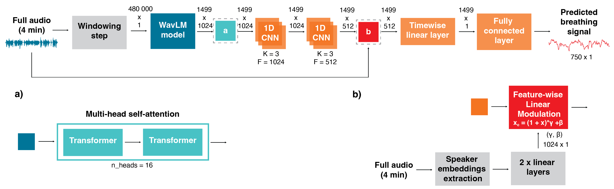

# Breathing Signal Prediction

Codebase for paper accepted to ICMI 2026 - "Breathing Signal Prediction from Speech: Toward Reproducible and Comparable Models"



## Installation

1. **Basic Installation**: `pip install -r requirements.txt`
2. **Virtual Environment Setup (Recommended)**:
   - Uses `venv` to create an isolated environment.
   - Provides activation steps for both macOS/Linux and Windows.

## Structure
```bash
├── src
│   ├── evaluate_on_test.py  # Evaluates the proposed model on the test set
│   ├── data_preparation.py # Functions necessary for data preparation
│   ├── model_definition.py # Model implementation
│   ├── init.py
│   ├── utils.py # Various functions to assist with cross-validation and prediction
│   ├── train_and_eval.py # Trains and evaluates models in a cross-validation setting
│   ├── config.py # Defines common paths and experimental parameters for the models reported in our paper
│   ├── cross_validation_train.py # Functions related to cross-validation and evaluation
│   ├── get_alignment_audible_signal.py # Gets alignment between automatically predicted audible breath events and inhalation
│   ├── get_opensmile.py # Get opensmile features per file (necessary to run the models with a FiLM layer)
│   └── get_wespeaker.py # Get wespeaker features per file (necessary to run the models with a FiLM layer)
└── data 
├── wav # Folder containing audio (.wav) files
├── ground_truth # Folder containing "labels.csv," which holds breathing signal values for all samples
├── models # Folder where models will be saved
└── output # Folder where predicted breathing signals will be saved
```

## Dataset Access
To access the UCL-SBM dataset, please contact Dr. Alexis Deighton MacIntyre: [AlexisDeighton.MacIntyre@mrc-cbu.cam.ac.uk](mailto:AlexisDeighton.MacIntyre@mrc-cbu.cam.ac.uk)


## Trained Models
*Insert link to zenodo*


